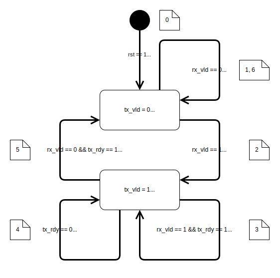
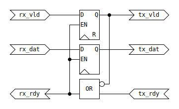
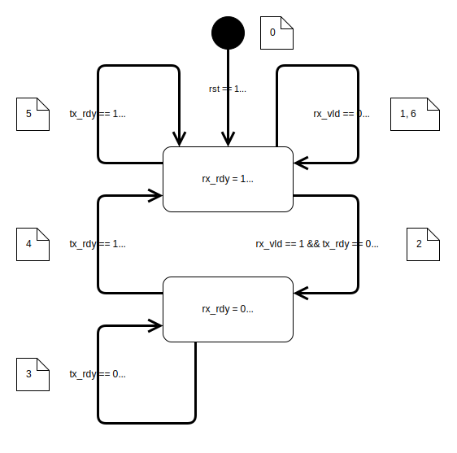
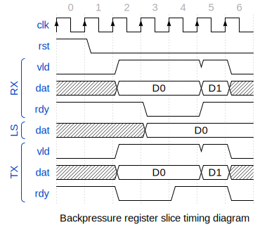

= VALID/READY handshake
:source-highlighter: rouge
:sectnums:
:toc:

== Introduction

The VALID/READY synchronous handshake is the basis for the
AMBA AXI family of protocols. The official
https://developer.arm.com/documentation/ihi0051/latest/[AMBA® AXI-Stream Protocol Specification]
provides a good definition and use case.

While the protocol can be used without data (just for event synchronization)
most of the document assumes the handshake is used to control a data stream.
The data stream is generalized compared to the standard AXI-Stream.

NOTE: There are many similar handshake protocols that can use signal names like
REQUEST, CYCLE, SELECT, ... instead of VALID and
GRANT, ACKNOWLEDGE, ... instead of READY.
This document does not provide any comparisons to other similar protocols.

NOTE: Asynchronous handshake protocols as an alternative
are only mentioned among the references.

This document provides a correct and optimal implementation of the handshake.

=== Terminology

This document uses terminology from AMBA AXI standards
with the purpose to be consistent across documentation and source code.

Datapath/Stream:: Group of signals going from transmitter to receiver
containing data and encoding data structure information
(byte enable, packet boundaries, routing, ...).

Transfer:: The value of the whole datapath
is transferred from transmitter to receiver
when VALID and READY are active simultaneously.

Packet:: One or more transfers ending with the LAST signal.

Component:: Either a transmitter or receiver,
can also be both or have multiple streaming interfaces.

Transmitter:: Component, source for VALID and datapath and destination for READY.

Receiver:: Component, destination for VALID and datapath and source for READY.

Monitor:: Component, destination for VALID, datapath and READY.

Port:: An individual scalar or vector signal of the datapath/stream interface.

Source:: Component port, output.

Destination:: Component port, input.

Interface:: A collection of ports implementing the stream protocol (datapath and handshake).

Asserted:: An active high signal being high (`1`).

Negated:: An active high signal being low (`0`).

=== Rules

NOTE: The https://developer.arm.com/documentation/ihi0051/latest/[AMBA® AXI-Stream Protocol Specification]
section _Handshake signaling_ defines the handshake protocol with 3 base rules.
Additional reset considerations are defined in section _Clock and Reset_.

Since the standard is copyrighted, the rules listed here are not a verbatim copy.
This document also attempts to write the rules with
less formal easy to remember phrases and *keywords*.

Some implementation context and standard practices are listed here,
further rule clarifications and implementation details are provided
in the following sections.

The described handshake is synchronous, which means
all events/changes happen on the rising edge of the clock.

Datapath/stream transfer:::
. The datapath is *invalid* and *static* during reset.
* For the invalid part see the VALID behavior rule 1, the static part affects power consumption.
+
_The AXI standard does not explicitly specify this rule, this is just a reasonable common practice._

. VALID and READY active simultaneously indicate a datapath *transfer*.

. The order in which handshake signals are asserted is not restricted.

. Datapath *valid* and *stable* conditions:
* The datapath shall become *valid* when VALID is asserted,
* and shall remain *stable* (non changing) till a transfer occurs.
* While VALID is negated, datapath signals are *not valid* (can be of any value).
+
_While not required by the standard, datapath signal toggling should be minimized to achieve low power consumption._

VALID behavior:::
. VALID shall be *negated* during reset.

. VALID shall *not wait* for READY.
* A transmitter shall not wait for a receiver to assert READY before asserting VALID.
+
_This rule is intended to prevent the insertion/propagation of bubbles in the stream pipeline._

. *Keep* VALID *asserted* till a *transfer*.
* VALID can only transition from asserted to negated after a handshake transfer event.
+
_Once the transmitter makes the datapath available, it shall not be removed before the receiver accepts it._

READY behavior:::
. READY shall be *static* during reset.
+
_The AXI standard does not explicitly specify this rule,
this is just a reasonable common practice._
+
_Being *asserted* during reset is a good design choice for many implementations._

. READY *can wait* for VALID.
* A receiver can wait for the transmitter to assert VALID before asserting READY.
+
_A receiver might process the currently available datapath
for multiple clock periods before being ready for the next._

. READY *can change* without waiting for VALID.
* READY can be negated by a receiver without waiting for the transmitter to assert VALID.
+
_Use cases are synchronous clock domain crossing (to a slower clock),
priority arbiter (when a higher priority receiver asserts VALID), ..._

== Source code

This document is accompanied by SystemVerilog and VHDL source code
for the RTL implementation and test-benches.

.SystemVerilog modules
[cols="5,1,1,10"]
|===
| module | RTL | TB | description

| `register_slice_datapath`
| link:../rtl/handshake/register_slice_datapath.sv[RTL]
| link:../tb/handshake/register_slice_datapath_tb.sv[TB]
| Register slice for the VALID signal and data path.

| `register_slice_backpressure`
| link:../rtl/handshake/register_slice_backpressure.sv[RTL]
| link:../tb/handshake/register_slice_backpressure_tb.sv[TB]
| Register slice for the backpressure signal READY.

| `register_slice_datapath`
| link:../rtl/handshake/register_slice_datapath.sv[RTL]
| link:../tb/handshake/register_slice_datapath_tb.sv[TB]
| Register slice combining forward and backward paths.
|===

.VHDL-2008 entities/components
[cols="5,1,1,10"]
|===
| component | RTL | TB | description

| `register_slice_datapath`
| link:../rtl/handshake/register_slice_datapath.vhd[RTL]
| link:../tb/handshake/register_slice_datapath_tb.vhd[TB]
| Register slice for the VALID signal and data path.

| `register_slice_backpressure`
| link:../rtl/handshake/register_slice_backpressure.vhd[RTL]
| link:../tb/handshake/register_slice_backpressure_tb.vhd[TB]
| Register slice for the backpressure signal READY.

| `register_slice_datapath`
| link:../rtl/handshake/register_slice_datapath.vhd[RTL]
| link:../tb/handshake/register_slice_datapath_tb.vhd[TB]
| Register slice combining forward and backward paths.
|===

=== Running simulations

The testbenches are designed to provide full control logic coverage
with the fewest clock cycles possible.

==== Questa simulator

From the Git root change to the Questa simulation folder and
source the script for setting up tool paths
(the script might have to be modified to point to your tool installation folder).

[source,bash]
----
cd sim/questa
. settings.sh
----

Execute the build script for either SystemVerilog or VHDL sources.

[source,bash]
----
./build_systemverilog.sh register_slice_datapath_tb register_slice_backpressure_tb
./build_vhdl.sh register_slice_datapath_tb register_slice_backpressure_tb
----

==== Xilinx Vivado simulator

TODO

==== GHDL

From the Git root change to the GHDL simulation folder
(GHDL must be installed on the system, or the `PATH` to executables be defined).
Execute the build script for VHDL sources.

[source,bash]
----
cd sim/ghdl

./build.sh register_slice_datapath_tb register_slice_backpressure_tb
----

==== Verilator

IMPORTANT: Although scripts for running simulations using Verilator are provided,
the simulator currently lacks proper support for non blocking assignment inside `initial` blocks,
thus it does not run the simulation correctly.

== Stream Interface

To be able to create compact tables and diagrams,
interface port names are shortened to a https://en.wikipedia.org/wiki/Three-letter_acronym[TLA].

* `clk` is for CLOCK,
* `rst` is for RESET,
* `vld` is for VALID,
* `dat` is for the datapath,
* `rdy` is for READY.

.Handshake between transmitter and receiver (with monitor)
image::handshake/handshake_transmitter_interface_receiver.svg[Handshake between transmitter and receiver (with monitor)]

Signals have 4 possible sources/destinations:

* system (global clock/reset signals from a centralized controller),
* transmitter (datapath source),
* receiver (datapath destination)
* local (combinational transfer signal).

A common stream processing module possesses
a receiving interface (`rx_*` prefixed ports) and
a transmitting interface (`tx_*` prefixed ports).

.Stream processing module
image::handshake/stream_processing_module.svg[Stream processing module]

The datapath port `dat` is fully customized using a type parameter/generic.

.parameters/generics
[cols="1,4,5,3"]
|===
| Generic   | SystemVerilog type (default) | VHDL type (default)                       | Description

| `DAT_TYP` | `type` (`logic [8-1:0]`)     | `type` (`std_logic_vector(8-1 downto 0)`) | Data Type.
| `DAT_RST` | `DAT_TYP` (`'x`)             | `DAT_TYP` (`+(others => '0)+`)            | Data reset value.
| `LOW_PWR` | `bit` (`1'b1`)               | `boolean` (`TRUE`)                        | Enable low-power implementation.
|===

TODO: add reset and power parameters.

System signals can be global (most common) or specific to the given interface.

.system signals
[cols="1,2,2,2,4"]
|===
| Signal | SystemVerilog type | VHDL type   | Direction | Description

| `clk`  | `logic`            | `std_logic` | global    | Clock, only the rising edge should be active.
| `rst`  | `logic`            | `std_logic` | global    | Active high reset.
|===

The protocol handshake and a generic data bus.

.handshake/datapath
[cols="1,2,2,2,4"]
|===
| Signal | SystemVerilog type | VHDL type   | Direction | Description

| `vld`  | `logic`            | `std_logic` | TX -> RX  | Handshake data valid.
| `dat`  | `DAT_TYP`          | `DAT_TYP`   | TX -> RX  | Data payload.
| `rdy`  | `logic`            | `std_logic` | RX -> TX  | Handshake back-pressure ready.
|===

The transfer signal defines a reusable condition,
simultaneous VALID and READY (`trn = vld & rdy`).

.local
[cols="1,2,2,6"]
|===
| Signal | SystemVerilog type | VHDL type   | Description

| `trn`  | `logic`            | `std_logic` | Datapath transfer.
|===

== RTL modules

This document only provides an RTL implementation
for very basic stream pipeline modules, register slices.

* *forward datapath* register slice,
* *backpressure* register slice.

NOTE: Some similar documents use the term *skid buffer*,
but I find the term _skid_ to lack any recognizable technical meaning,
and it seems to be used inconsistently across literature.

The implementation follows the next principles:

. protocol rule compliance,
. maximum throughput and minimum latency,
. no unnecessary internal states, minimized complexity
. minimized signal toggling for low power consumption.

In an attempt to make the document accessible
to users with different backgrounds,
the protocol implementation is described
with the same details seen from different points of view.

* state transition diagram,
* state transition table,
* timing diagram (waveform),
* VHDL/Verilog/SystemVerilog RTL code.
* assertions for formal verification (TODO).

The implementation logic is derived from state transition tables.

=== Common implementation details

The following implementation technology specific (ASIC/FPGA)
choices have been made:

* only clock rising edge sensitive logic is used,
* the reset state of datapath signal flip-flops can be undefined
  (slightly smaller area for ASIC implementations),
* the set/reset signal can be either:
** asynchronous (common in ASIC designs) or
** synchronous (preferred by some FPGA vendors).

==== Flip-flops with clock enable

D-type flip-flops with clock enable and optional set/reset are used
in schemes, since they are a good fit for the problem,
and they make the schematic diagrams simple.

.Flip-flop with clock enable input
image::handshake/flip-flop-enable.svg[D-type Flip-Flop with clock enable]

Some FPGA architectures or ASIC standard cell libraries
might not provide registers with clock enable (data/write/load/... enable),
in this case a flip-flop with an external loopback and multiplexer is used
instead instead of them being part of the flip-flop cell itself.

.Flip-flop with loopback implementing write enable
image::handshake/flip-flop-loopback.svg[D-type Flip-Flop with loopback]

.Comparison of D-type flip-flop standard cells with and without clock enable
[stripes=hover, cols="3,1,3"]
|===
| PDK/library/cell
| area
| description

| https://skywater-pdk.readthedocs.io/en/main/contents/libraries/sky130_fd_sc_hd/cells/dfxtp/README.html[sky130_fd_sc_hd/dfxtp]
|
|

| https://skywater-pdk.readthedocs.io/en/main/contents/libraries/sky130_fd_sc_hd/cells/mux2/README.html[sky130_fd_sc_hd/mux2]
|
|

| https://skywater-pdk.readthedocs.io/en/main/contents/libraries/sky130_fd_sc_hd/cells/edfxtp/README.html[sky130_fd_sc_hd/edfxtp]
|
| loopback enable

| https://skywater-pdk.readthedocs.io/en/main/contents/libraries/sky130_fd_sc_hs/cells/dfxtp/README.html[sky130_fd_sc_hs/dfxtp]
|
|

| https://skywater-pdk.readthedocs.io/en/main/contents/libraries/sky130_fd_sc_hs/cells/mux2/README.html[sky130_fd_sc_hs/mux2]
|
|

| https://skywater-pdk.readthedocs.io/en/main/contents/libraries/sky130_fd_sc_hs/cells/edfxtp/README.html[sky130_fd_sc_hs/edfxtp]
|
| loopback enable

| https://skywater-pdk.readthedocs.io/en/main/contents/libraries/sky130_fd_sc_ls/cells/dfxtp/README.html[sky130_fd_sc_ls/dfxtp]
|
|

| https://skywater-pdk.readthedocs.io/en/main/contents/libraries/sky130_fd_sc_ls/cells/mux2/README.html[sky130_fd_sc_ls/mux2]
|
|

| https://skywater-pdk.readthedocs.io/en/main/contents/libraries/sky130_fd_sc_ls/cells/edfxtp/README.html[sky130_fd_sc_ls/edfxtp]
|
| loopback enable

| https://gf180mcu-pdk.readthedocs.io/en/latest/digital/standard_cells/gf180mcu_fd_sc_mcu7t5v0/cells/dffq/gf180mcu_fd_sc_mcu7t5v0__dffq_1.html[gf180mcu_fd_sc_mcu7t5v0/dffq_1]
| 63.660800 µm²
|

| https://gf180mcu-pdk.readthedocs.io/en/latest/digital/standard_cells/gf180mcu_fd_sc_mcu7t5v0/cells/mux2/gf180mcu_fd_sc_mcu7t5v0__mux2_1.html[gf180mcu_fd_sc_mcu7t5v0/mux2_1]
| 28.537600 µm²
|

| https://gf180mcu-pdk.readthedocs.io/en/latest/digital/standard_cells/gf180mcu_fd_sc_mcu9t5v0/cells/dffq/gf180mcu_fd_sc_mcu9t5v0__dffq_1.html[gf180mcu_fd_sc_mcu9t5v0/dffq_1]
| 79.027200 µm²
|

| https://gf180mcu-pdk.readthedocs.io/en/latest/digital/standard_cells/gf180mcu_fd_sc_mcu9t5v0/cells/mux2/gf180mcu_fd_sc_mcu9t5v0__mux2_1.html[gf180mcu_fd_sc_mcu9t5v0/mux2_1]
| 36.691200 µm²
|

| file:///home/izi/Downloads/sg13g2_stdcell_typ_1p20V_25C.pdf[sg13g2/dfrbp_1]
| 47.17440 µm²
| active low reset

| file:///home/izi/Downloads/sg13g2_stdcell_typ_1p20V_25C.pdf[sg13g2/mux2_1]
| 18.14400 µm²
|
|===

==== Clock gating

Clock gating is an area and power efficient alternative to a loopback.
The open source tool Lighter<<lighter>> provides
a good explanation and examples.

==== Optional datapath reset

Reset for the detapath is described as optional,
since it is not strictly necessary for implementing desired functionality.
This is a somehow controversial topic, so I will not provide a final judgement.
In the end it usually comes to personal preferences of individual developers.

The main argument for datapath reset is usually to create a repeatable reset sequence,
in terms of system state and power consumption.
In general, the unpredictability is not expected to be large enough
to significantly affect measurements.

The main argument for omitting reset, would be to slightly reduce area and power.
The following table provides a comparison between asynchronous reset and no reset
for a few open source PDK standard cell libraries.

.Comparison of D-type flip-flop standard cells with and without reset
[stripes=hover, cols="3,1,3"]
|===
| PDK/library/cell
| area
| description

| https://skywater-pdk.readthedocs.io/en/main/contents/libraries/sky130_fd_sc_hd/cells/dfrtp/README.html[sky130_fd_sc_hd/dfrtp]
|
| inverted reset

| https://skywater-pdk.readthedocs.io/en/main/contents/libraries/sky130_fd_sc_hd/cells/dfxtp/README.html[sky130_fd_sc_hd/dfxtp]
|
|

| https://gf180mcu-pdk.readthedocs.io/en/latest/digital/standard_cells/gf180mcu_fd_sc_mcu7t5v0/cells/dffrnq/gf180mcu_fd_sc_mcu7t5v0__dffrnq_1.html[gf180mcu_fd_sc_mcu7t5v0/dffrnq_1]
| 74.636800 µm²
| active low reset

| https://gf180mcu-pdk.readthedocs.io/en/latest/digital/standard_cells/gf180mcu_fd_sc_mcu7t5v0/cells/dffq/gf180mcu_fd_sc_mcu7t5v0__dffq_1.html[gf180mcu_fd_sc_mcu7t5v0/dffq_1]
| 63.660800 µm²
|

| https://gf180mcu-pdk.readthedocs.io/en/latest/digital/standard_cells/gf180mcu_fd_sc_mcu9t5v0/cells/dffrnq/gf180mcu_fd_sc_mcu9t5v0__dffrnq_1.html[gf180mcu_fd_sc_mcu9t5v0/dffrnq_1]
| 90.316800 µm²
| active low reset

| https://gf180mcu-pdk.readthedocs.io/en/latest/digital/standard_cells/gf180mcu_fd_sc_mcu9t5v0/cells/dffq/gf180mcu_fd_sc_mcu9t5v0__dffq_1.html[gf180mcu_fd_sc_mcu9t5v0/dffq_1]
| 79.027200 µm²
|

| file:///home/izi/Downloads/sg13g2_stdcell_typ_1p20V_25C.pdf[sg13g2_dfrbp_1]
| 47.17440 µm²
| active low reset
|===

==== Complexity versus power optimizations

This document provides implementations with two distinct optimizations:

* low-complexity: focusing on simple control logic,
* low-power: focusing on minimizing signal toggling.

The low-power approach adds a single logic gate compared in the control path
and does not affect the datapath complexity.
On the other hand it can provide power savings in multiple non trivial designs.
Therefore it is the preferred default implementation.

I will try to explain how this implementations would behave
for some common applications.

Simple DSP pipeline:::
In such a pipeline each stage takes a single clock period to process the data.
VALID and READY signals are asserted most of the time,
so the datapath makes one step forward in the pipeline on each clock cycle.
In this situation the low-power implementation would not reduce any toggling.
The control logic for such a pipeline is rather trivial
and therefore not containing critical paths (those are in the datapath).
So using the low-complexity implementation would not shorter any critical paths.
As a summary, there is no advantage to either implementation.

AXI crossbar:::
For this example using a simple architecture with a single manager and multiple subordinates,
where each subordinate interface has datapath register slices in the M->S direction.
While the manager is performing transactions, datapath signals in WA, W, RA channels would be toggling.
The low-power implementation prevents this toggling from being propagated
to all but the selected subordinate.
The low-complexity implementation would allow toggling intended for a single subordinate
to propagate to all subordinate interfaces thus increasing power consumption.
On the other hand, such a crossbar contains an arbiter in the control logic path,
so choosing the low-complexity implementation might improve timing
(depending on whether this is the critical path for the entire clock domain).

WARNING: Some implementations misuse a different low power technique,
by loading the datapath register with zeros when it contains no valid data.
This has the opposite effect by adding unnecessary toggling to the registers.
Additionally it requires a masking gate for each datapath bit thus increasing area.

=== Datapath register slice

The datapath register slice is a basic building block
of every stream processing pipeline.
Its main purpose is to split long VALID/datapath
combinational paths into shorter segments,
which meet given static timing requirements.
The critical path (largest delay) is usually part of the datapath,
where most processing takes place.

This module requires registers for TX output ports:

* `tx_vld` register is also used to encode the module internal state,
* `tx_dat` register for the datapath value.

==== Datapath register slice behavior

The following state transition diagram defines the behavior.
Each state transition represents a clock rising edge.

.Datapath register slice state transition diagram

Transitions from the diagram can be described using the protocol rules:

[start=0]
. After RESET (`+rst == 1+`) enter the NON-VALID state,
  where TX is not valid and RX is ready.

NON-VALID::: *Negated TX VALID* (`+tx_vld <= '0+`) and *non valid TX datapath* (`+tx_dat <= 'x+`),
while keeping *asserted RX READY* (`+rx_rdy = '1+`) regardless of TX ready state.

. While *RX datapath is not valid* (`+rx_vld == '0+`), stay in the NON-VALID state.

. With *asserted RX VALID* (`+rx_vld == '1+`),
  do *not wait* for TX to be ready,
  change the state by *asserting TX VALID* (`+tx_vld <= '1+`).
  This is also a *RX transfer*,
  so *copy* the *valid* datapath from RX to TX (`+tx_dat <= rx_dat+`)
  thus enter the VALID state.

VALID::: *Asserted TX VALID* (`+tx_vld <= '1+`) and *valid TX datapath*,
while *RX READY depends on TX ready* (`+rx_rdy = tx_ready+`).

. While in the VALID state and *asserted RX VALID* (`+rx_vld == '1+`) and
  *asserted TX READY* (`+tx_rdy == '1+`) there are
  *RX transfer* (`+rx_vld & rx_rdy == '1+`),
  *TX transfer* (`+tx_vld & tx_rdy == '1+`) and
  the datapath is *copied* from RX to TX (`+tx_dat <= rx_dat+`)
  thus stay in the VALID state.

. While in the VALID state with *negated TX READY* (`+tx_rdy == '0+`) there is no TX transfer,
  and since TX READY it is combinationaly propagated to RX there is also no RX transfer.
  TX VALID and datapath must remain *stable*, remain in the VALID state.

. While in the VALID state with *asserted RX READY* (`+rx_rdy = '1+`) there is a *TX transfer*,
  with *negated RX VALID* (`+rx_vld == '0+`) there is no RX transfer.
  RX VALID propagates sequentially to TX VALID (`+tx_vld <= '0+`).
  *TX datapath becomes invalid*, but should be *kept* unchanged to avoid unnecessary toggling,
  enter the VALID state.

. Since the *TX datapath is invalid*,
  it is *ready* to accept new data,
  therefore *RX READY is asserted* (`+rx_rdy = '1+`).

Transitions from the state transition diagram
taken in a clockwise order, can be written into a table.

.Datapath register slice state transition table
[stripes=hover, cols="2,2,2,3,2,2,2"]
|===
2+h| inputs at `[t]`
  h| state at `[t]`
  h| comb. output at `[t]`
2+h| seq. state/output at `[t+1]`
.2+h| Transition

h|`rx_vld`
h|`tx_rdy`
h|`tx_vld`
h|`rx_rdy`
h|`tx_vld`
h|`tx_dat`

| `0` | `x` | `0` | `1` | `0` copy/keep | don't care    | 1, 6
| `1` | `x` | `0` | `1` | `1` copy      | copy `rx_dat` | 2
| `1` | `1` | `1` | `1` | `1` copy/keep | copy `rx_dat` | 3
| `x` | `0` | `1` | `0` | `1`      keep | keep `tx_dat` | 4
| `0` | `1` | `1` | `1` | `0` copy      | don't care    | 5
|===

==== Datapath register slice SystemVerilog implementation

The logic for the RX READY backpressure signal `rx_rdy`
can be derived (see state transition table)
from transitions (1, 2, 3, 5) with asserted `rx_rdy`,
but it is easier to use the single transition (4) with negated `rx_rdy`.

[source, verilog, linenums]
----
rx_rdy = ~((rx_vld == 1'bx) & (tx_vld == 1'b1) & (tx_rdy == 1'b0));
----

The logic can be simplified into the equation used in the source code.

[source, verilog, linenums]
----
include::../rtl/handshake/register_slice_datapath.sv[lines=38..39]
----

TIP: RX is *ready* when TX is *ready* or the TX datapath register is empty.

The logic for the TX VALID signal/state `tx_vld` can be derived from:

. The reset state is `1'b0`, indicating the datapath register is not valid.
. The state transition table defines the following transitions:
  * *2*/*5*: `rx_vld` must be copied to `tx_vld`,
  * *4*: `tx_vld` must be kept unchanged,
  * *1*/*3*: the value can be either copied or kept unchanged.

The transitions (1, 3) where the TX VALID register `tx_vld` value
can be either copied or kept, can be ignored.
The conditions for the remaining transitions (2, 4, 5)
can be fulfilled by using `rx_rdy` as
the clock enable for the `tx_vld` register.

[source, verilog, linenums]
----
include::../rtl/handshake/register_slice_datapath.sv[lines=41..49]
----

TIP: TX is not *valid* after reset,
and is copied from RX to TX when RX is *ready*.

The datapath register implementation has some flexibility
regarding reset and minimizing toggling (power).

The logic for the TX datapath register `tx_dat` can be derived from:

. The reset state can be any constant (usually `'0`) or an undefined value (`'x`).
. The state transition table defines the following transitions:
  * *2*/*3*: `rx_dat` must be copied to `tx_dat`,
  * *4*: `tx_dat` must be kept unchanged,
  * *1*/*5*: the value can be either
    copied (low complexity) or kept unchanged (low power).

===== Low complexity implementation

Transitions (1, 5) resulting in either a copy or no change can be ignored.
This results in the same logic conditions as for the `tx_vld` signal/state,
`rx_rdy` is used as clock enable for the datapath register.

[source, verilog, linenums]
----
if (rx_rdy)  tx_dat <= rx_dat;
----

TIP: Copy the datapath value from RX to TX when RX is *ready*.

.Datapath register slice (low complexity) schematic

A short simulation performing in order the steps from the state transition table,
results in the following timing diagram.

.Datapath register slice (low complexity) timing diagram

The following transition list describes how they affect power:

. Undesired: `rx_dat` change can be propagated to `ls_dat` while RX is not valid.
. Required: `rx_dat` copy into `ls_dat`.
. Required: `rx_dat` copy into `ls_dat`.
. Required: `ls_dat` keeps its value.
. Undesired: `rx_dat` change can be propagated to `ls_dat` while RX is not valid.

===== Low power implementation

Clock enable can be only asserted when a transition (2, 3)
explicitly requires a copy form RX to TX.
Invalid values on the RX datapath will never be copied
to the TX datapath register.

Transitions 2, 3 are the only ones where
`rx_vld` and `rx_rdy` are both asserted,
this is equivalent to the RX transfer condition.

[source, verilog, linenums]
----
include::../rtl/handshake/register_slice_datapath.sv[lines=34..35]
----

[source, verilog, linenums]
----
include::../rtl/handshake/register_slice_datapath.sv[lines=51..59]
----

TIP: Copy the datapath value from RX to TX only on RX *transfer*.

.Datapath register slice (low power) schematic
image::handshake/register_slice_datapath_lowpower_schematic.svg[Datapath register slice (low power) schematic]

A simulation results in the following timing diagram.

.Datapath register slice (low power) timing diagram

There is no undesired datapath register `tx_dat` toggling.

=== Backpressure register slice

The backpressure register slice is sometimes needed on a long stream processing pipeline.
Its purpose is to cut combinational READY signal paths into sections
short enough to meet static timing requirements.
Since the READY logic is usually much simpler compared to datapath processing,
it is usually enough to use much fewer backpressure register slices
compared to the number of datapath slices (pipeline stages).

This module requires registers for RX output ports, and local datapath storage:

* `rx_rdy` register also defines the internal state of the module,
* `ls_dat` local storage register holds the a temporary datapath value.

==== Backpressure register slice behavior

The following state transition diagram defines the behavior. Each state transition represents a clock rising edge.

.Backpressure register slice state transition diagram

Transitions from the diagram can be described using the protocol rules:

[start=0]
. After RESET (`+rst == 1+`) enter READY state, where RX is ready and local storage is vot valid.

READY::: *Asserted RX READY* (`+rx_rdy = 1+`) and *non valid local storage* (`+ls_dat <= 'x+`).
VALID and the datapath are combinationally propagated from RX to TX
(`+tx_vld = rx_vld+`, `+tx_dat = rx_dat+`).

. While *RX datapath is not valid* (`+rx_vld == '0+`), stay in the READY state.
  Local storage should be *kept unchanged* to avoid unnecessary toggling.

. With *asserted RX VALID* (`+rx_vld == '1+`), there is a *RX transfer*.
  Due to *negated TX READY* (`+tx_rdy == '0+`) the RX transfer can't be propagated to a TX transfer,
  therefore RX datapath must be remembered inside local storage (`+ls_dat <= rx_dat+`),
  thus enter the NOT-READY state.

NOT-READY: *Negated RX READY* (`+rx_rdy = 0+`) and *valid local storage*
(since local storage is already valid, RX is not able to accept new data).
Also *asserted TX VALID* (`+tx_vld = '1+`) and *TX datapath is linked to local storage* `+tx_dat = ls_dat+`.

. With *TX READY negated* (`+tx_rdy == '0+`) new data can not be propagated from RX to TX,
  therefore *local storage must keep it's contents*.

. With *TX READY asserted* (`+tx_rdy == '1+`), there is a *TX transfer* with datapath from local storage.
  With local storage becoming empty, the state becomes READY again.
  With no RX transfer local storage should be *kept unchanged* to minimize datapath toggling.

. With *TX READY asserted* (`+tx_rdy == 1'+`) and *VALID and the datapath* combinationally propagated from RX to TX,
  an *asserted RX VALID* (`+rx_vld == '1+`) will cause a *transfer from RX to TX*,
  while a *negated RX VALID* (`+rx_vld == '0+`) will cause no change.
  Local storage should be *kept unchanged* to minimize datapath toggling.

. See transition 1.

Transitions from the state transition diagram taken in a clockwise order, can be written into a table.

.Backpressure register slice state transition table
[stripes=hover, cols="2,2,3,2,2,3,3,2"]
|===
2+h| inputs at `[t]`
  h| state at `[t]`
2+h| comb. outputs at `[t]`
2+h| seq. state/output/local at `[t+1]`
.2+h| Transition

h| `rx_vld`
h| `tx_rdy`
h| `rx_rdy`
h| `tx_vld`
h| `tx_dat`
h| `rx_rdy`
h| `ls_dat`

| `0` | `x` | `1` | `0`      | don't care | `1`      keep | don't care    | 1, 6
| `1` | `0` | `1` | `1`      | `rx_dat`   | `0` copy      | copy `rx_dat` | 2
| `x` | `0` | `0` | `1`      | `ls_dat`   | `0` copy/keep | keep `ls_dat` | 3
| `x` | `1` | `0` | `1`      | `ls_dat`   | `1` copy      | don't care    | 4
| `x` | `1` | `1` | `rx_vld` | `rx_dat`   | `1` copy/keep | don't care    | 5
|===

==== Backpressure register slice SystemVerilog implementation

The logic for the TX VALID signal `tx_vld`
can be derived (see state transition table) from transitions (2, 3, 4)
and transition (5) with asserted `rx_vld`.

[source, verilog, linenums]
----
tx_vld = ((rx_vld == 1'b1) & (tx_rdy == 1'b0) & (rx_rdy == 1'b1)) |  // T2
         ((rx_vld == 1'bx) & (tx_rdy == 1'b0) & (rx_rdy == 1'b0)) |  // T3
         ((rx_vld == 1'bx) & (tx_rdy == 1'b1) & (rx_rdy == 1'b0)) |  // T4
         ((rx_vld == 1'b1) & (tx_rdy == 1'b1) & (rx_rdy == 1'b1));   // T5
// don't care signals can be removed
tx_vld = ((rx_vld == 1'b1) & (tx_rdy == 1'b0) & (rx_rdy == 1'b1)) |  // T2
         (                 & (tx_rdy == 1'b0) & (rx_rdy == 1'b0)) |  // T3
         (                 & (tx_rdy == 1'b1) & (rx_rdy == 1'b0)) |  // T4
         ((rx_vld == 1'b1) & (tx_rdy == 1'b1) & (rx_rdy == 1'b1));   // T5
// replace comparison to constant with signal or negated signal
tx_vld = ( rx_vld & ~tx_rdy &  rx_rdy) |  // T2
         (        & ~tx_rdy & ~rx_rdy) |  // T3
         (        &  tx_rdy & ~rx_rdy) |  // T4
         ( rx_vld &  tx_rdy &  rx_rdy);   // T5
// apply distributivity to pairs T2|T5, T3|T4 to remove tx_rdy
tx_vld = ( rx_vld           &  rx_rdy) |  // T2|T5
         (                    ~rx_rdy);   // T3|T4
// apply absorption law
tx_vld = rx_vld | ~rx_rdy;
----

The reference implementation is using a slightly different
equivalent equation with a ternary operator.

[source, verilog, linenums]
----
include::../rtl/handshake/register_slice_backpressure.sv[lines=61..62]
----

TIP: When RX is *ready* then VALID is passed through,
otherwise local storage is *valid* and so is TX.

The logic for the RX READY signal/state `rx_rdy` can be derived from:

. The reset state is `1'b1`, indicating the local storage register is ready.
. The state transition table defines the following transitions:
  * *2*/*4*: `tx_rdy` must be copied to `rx_rdy`,
  * *1*: `rx_rdy` must be kept unchanged,
  * *3*/*5*: the value can be either copied or kept unchanged.

The transitions (3, 5) where the RX READY `rx_rdy` register value
can be either copied or kept, can be ignored.
The conditions for the remaining transitions (1, 2, 4)
can be fulfilled by using `tx_vld` as
the clock enable for the `rx_rdy` register.

[source, verilog, linenums]
----
include::../rtl/handshake/register_slice_backpressure.sv[lines=41..49]
----

TIP: RX is *READY* after reset,
and is copied from TX to RX when TX is *valid*.

The TX datapath `tx_dat` requires a combinational choice
between the RX datapath `rx_dat` and the local storage `ls_dat`.
The logic for multiplexing between the two can be derived from transitions:

  * *2*/*5*: `tx_dat` comes from `rx_dat`,
  * *3*/*4*: `tx_dat` comes from local storage `ls_dat`,
  * *1*: `tx_dat` is not valid, can be any value.

Using RX READY `rx_rdy` as the multiplexer select signal
matches the above conditions from the state transition table.

[source, verilog, linenums]
----
include::../rtl/handshake/register_slice_backpressure.sv[lines=63]
----

TIP: When RX is *ready*, TX datapath comes from RX,
otherwise it comes from local storage.

The local storage register implementation has some flexibility
regarding reset and minimizing toggling (power).

The logic for the local storage register `ls_dat` can be derived from:

. The reset state can be any constant (usually `'0`) or an undefined value (`'x`).
. The state transition table defines the following transitions:
  * *2*: `rx_dat` must be copied `ls_dat`,
  * *3*: `ls_dat` must be kept unchanged,
  * *1*/*4*/*5*: the value can be either
    copied (low complexity) or kept unchanged (low power).

===== Low complexity implementation

A clock enable equation for the `ls_dat` must be asserted on transition (2),
negated on transition (3), and can be any value for transitions (1,4,5).

The simplest equation is using just the `rx_rdy` signal,
which is active during transitions (1, 2, 5).

[source, verilog, linenums]
----
if (rx_rdy)  ls_dat <= rx_dat;
----

TIP: Copy the datapath value from RX to local storage when RX is *ready*.

.Backpressure register slice (low complexity) schematic

A short simulation performing in order the steps from the state transition table,
results in the following timing diagram.

.Backpressure register slice (low complexity) timing diagram

The following transition list describes how they affect power:

. Undesired: `rx_dat` change can be propagated to `ls_dat` while RX is not valid.
. Required: `rx_dat` copy into `ls_dat`.
. Required: `ls_dat` keeps its value.
. Desired: `ls_dat` keeps its value.
. Undesired: `rx_dat` copy into `ls_dat`.

===== Low power implementation

Clock enable can be only asserted when a transition (2)
explicitly requires a copy form RX to TX.
Invalid values on the RX datapath will never be copied into local storage.
Local storage will also stay unchanged,
if the datapath is combinationally passing from RX to TX.

The logic for clock enable is derived from transition 2:

[source, verilog, linenums]
----
ls_ena = ((rx_vld == 1'b1) & (tx_rdy == 1'b0) & (rx_rdy == 1'b1));  // T2
// replace comparison to constant with signal or negated signal
ls_ena = ( rx_vld & ~tx_rdy &  rx_rdy);  // T2
// combine RX handshake into transfer signal
ls_ena = rx_trn & ~tx_rdy;
----

[source, verilog, linenums]
----
include::../rtl/handshake/register_slice_backpressure.sv[lines=37..38]
----

[source, verilog, linenums]
----
include::../rtl/handshake/register_slice_backpressure.sv[lines=51..59]
----

TIP: Copy the datapath value from RX to TX only on RX *transfer* while TX is *not ready*.

.Backpressure register slice (low power) schematic
image::handshake/register_slice_backpressure_lowpower_schematic.svg[Backpressure register slice (low power) schematic]

A simulation results in the following timing diagram.

.Backpressure register slice (low power) timing diagram

There is no undesired local storage `ls_dat` toggling.

[bibliography]
== Bibliography

Asynchronous handshake:

* [[[micro, A1]]] Ivan E. Sutherland. MICROPIPELINES:
https://dl.acm.org/doi/pdf/10.1145/63526.63532

* [[[insensitive, A2]]] Luca P. Carloni. The Theory of Latency Insensitive Design:
https://ptolemy.berkeley.edu/projects/embedded/asves/dsm/lid/papers/lipTransactions.pdf

Synchronous handshake (register slice and skid buffer):

* [[[axi-interface-buffers, S1]]]
  https://pavel-demin.github.io/red-pitaya-notes/axi-interface-buffers/

* [[[pipeline-skid-buffer,  S2]]]
  http://fpgacpu.ca/fpga/Pipeline_Skid_Buffer.html

* [[[strategies-for-pipelining, S3]]]
  https://zipcpu.com/blog/2017/08/14/strategies-for-pipelining.html

* [[[skidbuffer, S4]]]
  https://zipcpu.com/blog/2019/05/22/skidbuffer.html

Public forum discussions:

* [[[axi4stream-register, S5]]]
  https://www.reddit.com/r/FPGA/comments/ebl8f2/what_are_some_use_cases_of_axi4stream_register/

* [[[skid-buffer-implementation, S6]]]
  https://www.reddit.com/r/FPGA/comments/107j9t9/simple_skid_buffer_implementation/

Open source RTL implementations:

* [[[pulp-platform-axi, R1]]] Pulp-Platform
https://github.com/pulp-platform/common_cells/blob/master/src/stream_register.sv

Clock gating:

* [[[lighter, G1]]] AUCOHL. https://github.com/AUCOHL/Lighter[Lighter]

* [[[lacg, G2]]] https://github.com/buttercutter/LACG?tab=readme-ov-file

* [[[osu, G3]]] Lusk, Hunter Brady. Power Optimization Through Clock Gating Standard Cells Designed for OSU VLSIARCH SKY130 Process
https://www.proquest.com/openview/f0ad5107661bc9d124f3cb6a043b4673/1?pq-origsite=gscholar&cbl=18750&diss=y

